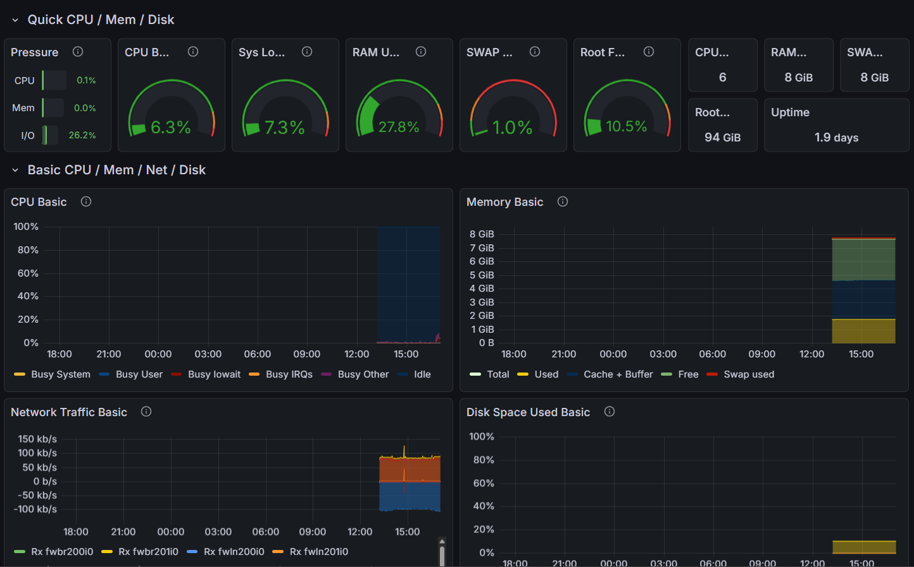
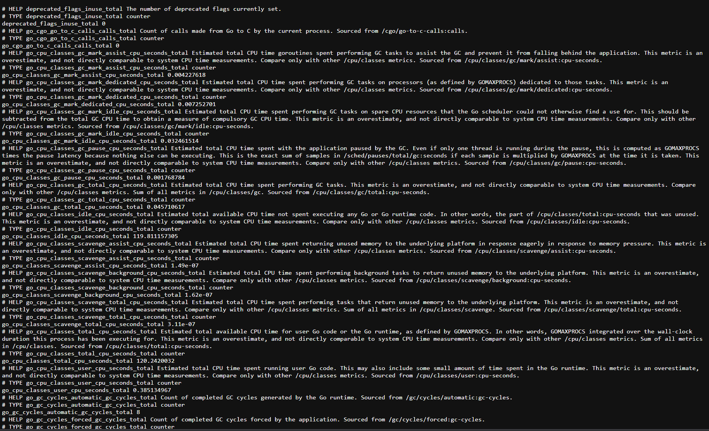

<!-- PROJECT SHIELDS -->
[![License][license-shield]][license-url]
[![LinkedIn][linkedin-shield]][linkedin-url]

<!-- PROJECT HEADER -->
 

  <h1 align="center">Home Cloud Observability Platform</h1>

  

    A production-grade observability stack deployed on Proxmox VE using Docker Compose. 
     
    Monitors metrics, logs, uptime, and alerts for homelab services.
     
     
    <a href="https://github.com/ewardGPT/home-cloud-observability">View Code</a>
    ·
    <a href="https://github.com/ewardGPT/home-cloud-observability/issues">Report Bug</a>
    ·
    <a href="https://github.com/ewardGPT/home-cloud-observability/issues">Request Feature</a>
  

<!-- TABLE OF CONTENTS -->

  
Table of Contents

  <ol>
    <li><a href="#about-the-project">About The Project</a></li>
    <li><a href="#built-with">Built With</a></li>
    <li><a href="#key-features">Key Features</a></li>
    <li><a href="#architecture">Architecture</a></li>
    <li><a href="#deployment">Deployment</a></li>
    <li><a href="#security">Security</a></li>
    <li><a href="#license">License</a></li>
    <li><a href="#contact">Contact</a></li>
  </ol>

<!-- ABOUT THE PROJECT -->
## About The Project

![Grafana Dashboard][product-screenshot]

A consolidated observability stack designed to bring enterprise-grade monitoring to a homelab environment. Deployed as a microservices architecture on an Ubuntu VM within Proxmox, this platform unifies metrics collection, log aggregation, and uptime monitoring into a single pane of glass.

Designed for **security** (LAN-only access) and **reliability** (automated alerts), it ensures high availability for self-hosted services.

(<a href="#readme-top">back to top</a>)

## Built With

### Core Infrastructure
* [![Proxmox][Proxmox]][Proxmox-url] - Virtualization Platform
* [![Ubuntu][Ubuntu]][Ubuntu-url] - Host OS (VM)
* [![Docker][Docker]][Docker-url] - Container Orchestration

### Observability Stack
* [![Prometheus][Prometheus]][Prometheus-url] - Metrics Collection
* [![Grafana][Grafana]][Grafana-url] - Visualization & Dashboards
* [![Loki][Loki]][Loki-url] - Log Aggregation
* [![Uptime Kuma][UptimeKuma]][UptimeKuma-url] - Synthetic Monitoring

(<a href="#readme-top">back to top</a>)

## Key Features

### 📊 Comprehensive Monitoring
- **Hardware Metrics**: Real-time tracking of CPU, RAM, Disk I/O, and Network traffic.
- **Service Health**: HTTP/TCP/Ping monitoring for all homelab services.
- **Log Aggregation**: Centralized log search and exploration via Grafana + Loki.

### 🛡️ Production-Grade Design
- **Secure Access**: Strictly isolated to the local network (LAN-only); no public exposure.
- **Alerting**: Automated notifications for downtime or performance anomalies.
- **Documentation**: Complete runbooks for deployment and operations.

(<a href="#readme-top">back to top</a>)

## Architecture

For a deep dive into the system design and data flow, please refer to the architecture documentation.

📄 **[View Architecture Docs](docs/01-architecture.md)**

(<a href="#readme-top">back to top</a>)

## Screenshots

### Proxmox Node Dashboards
| Main Dashboard | Lab Dashboard |
|:---:|:---:|
|  |  |

### Monitoring & Logs
| Uptime Kuma | Loki Logs |
|:---:|:---:|
|  |  |

*(Prometheus Tunnel and Targets pages are also available in the screenshots folder)*

(<a href="#readme-top">back to top</a>)

## Deployment

Detailed step-by-step instructions for deploying this stack on a fresh Ubuntu server.

📄 **[View Installation Guide](docs/02-installation.md)**

(<a href="#readme-top">back to top</a>)

## Security

Security configuration including firewall rules, user permissions, and access controls.

📄 **[View Security Notes](docs/03-security.md)**

(<a href="#readme-top">back to top</a>)

<!-- LICENSE -->
## License

Distributed under the MIT License. See [LICENSE](cci:7://file:///c:/Users/warde/Documents/Ervin%20Portfolio/LICENSE:0:0-0:0) for more information.

(<a href="#readme-top">back to top</a>)

<!-- CONTACT -->
## Contact

Ervin Ward - Cloud & AI Systems Architect

* 🌐 Portfolio: [ervinward.com](https://ervinward.com)
* 💼 LinkedIn: [linkedin.com/in/ervinwardiii](https://linkedin.com/in/ervinwardiii)
* 🐙 GitHub: [@ewardGPT](https://github.com/ewardGPT)

Project Link: [https://github.com/ewardGPT/home-cloud-observability](https://github.com/ewardGPT/home-cloud-observability)

(<a href="#readme-top">back to top</a>)

<!-- MARKDOWN LINKS & IMAGES -->
[license-shield]: https://img.shields.io/badge/License-MIT-blue.svg?style=for-the-badge
[license-url]: LICENSE
[linkedin-shield]: https://img.shields.io/badge/-LinkedIn-black.svg?style=for-the-badge&logo=linkedin&colorB=555
[linkedin-url]: https://linkedin.com/in/ervinwardiii
[product-screenshot]: screenshots/pve_grafana.png

[Proxmox]: https://img.shields.io/badge/Proxmox-E57000?style=for-the-badge&logo=proxmox&logoColor=white
[Proxmox-url]: https://www.proxmox.com/
[Ubuntu]: https://img.shields.io/badge/Ubuntu-E95420?style=for-the-badge&logo=ubuntu&logoColor=white
[Ubuntu-url]: https://ubuntu.com/
[Docker]: https://img.shields.io/badge/Docker-2496ED?style=for-the-badge&logo=docker&logoColor=white
[Docker-url]: https://www.docker.com/
[Prometheus]: https://img.shields.io/badge/Prometheus-E6522C?style=for-the-badge&logo=prometheus&logoColor=white
[Prometheus-url]: https://prometheus.io/
[Grafana]: https://img.shields.io/badge/Grafana-F46800?style=for-the-badge&logo=grafana&logoColor=white
[Grafana-url]: https://grafana.com/
[Loki]: https://img.shields.io/badge/Loki-F46800?style=for-the-badge&logo=grafana&logoColor=white
[Loki-url]: https://grafana.com/oss/loki/
[UptimeKuma]: https://img.shields.io/badge/Uptime%20Kuma-17CE67?style=for-the-badge&logo=uptime-kuma&logoColor=white
[UptimeKuma-url]: https://uptime.kuma.pet/
